# Credit_Risk_Analysis
Supervised Learning 

## Table of Contents
- [Overview of Project](#OverviewProject)
- [Results](#results)
  * [Naive Random Oversampling and Logistic Regression](#oversampling)
  * [SMOTE Oversampling and Logistic Regression](#smote)
  * [Cluster Centroids Undersampling algorithm and Logistic Regression](#undersampling)
  * [SMOTEENN Combination Sampling algorithm and Logistic Regression](#combination)
  * [Balanced Random Forest algorithm](#r_forest)
  * [Easy Ensemble ADA Boost Classifier](#ADABoost)
- [Summary](#summary)
- [Resources](#resources)
- [References](#references)

## Overview of Project

In this project we are analyzing the [Credit Loan data](LoanStats_2019Q1.csv) and trying to predict credit risk withe the help of several Supervised machine learning models.

Credit risk is an inherently unbalanced classification problem, as good loans easily outnumber risky loans. Therefore, we will need to employ different techniques to train and evaluate models with unbalanced classes. In this project we are using **imbalanced-learn and scikit-learn libraries** to build and evaluate models using resampling.

Using the credit card credit dataset from LendingClub, a peer-to-peer lending services company, we will ***oversample*** the data using the **RandomOverSampler** and **SMOTE** algorithms, and ***undersample*** the data using the **ClusterCentroids algorithm**. Then, we’ll use a ***combinatorial approach*** of over- and undersampling using the **SMOTEENN** algorithm. 
We will use two new machine learning models that reduce bias, **BalancedRandomForestClassifier** and **EasyEnsembleClassifier**, to predict credit risk. In the end we will evaluate the performance of these models and make a written recommendation on whether they should be used to predict credit risk.

## Results

###  Naive Random Oversampling and Logistic Regression

In **Random oversampling**, instances of the minority class are randomly selected and added to the training set until the majority and minority classes are balanced.

1. Accuracy: 65.11% 

2. Confusion Matrix: 

   
 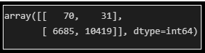 
 
    
3. Classification Report: 
   
 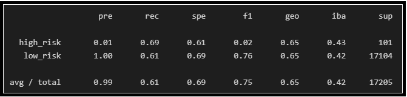 
 

***The accuracy score of 65.11 for this model is low. The F1 score and Precision for high-risk prediction is only .02 and .01 only. The higher the F1 score (close to 1) the better it is. Hence this model is not a very good model for predicting high credit risk.***

###  SMOTE Oversampling and Logistic Regression

The **synthetic minority oversampling technique (SMOTE)** is another oversampling approach to deal with unbalanced datasets. In SMOTE, like random oversampling, the size of the minority is increased. In SMOTE, new instances are interpolated. That is, for an instance from the minority class, a number of its closest neighbors is chosen. Based on the values of these neighbors, new values are created.
Although SMOTE reduces the risk of oversampling, it is vulnerable to outliers. If the neighbors are extreme outliers, the new values will reflect this. 

1. Accuracy: 65.72% 
    
2. Confusion Matrix: 
   
 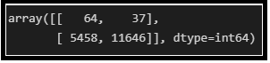 
 
3. Classification Report: 
   
 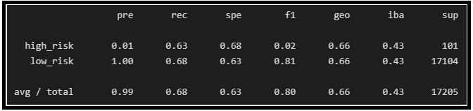 
 

***The accuracy score of 65.72 for this model is low. The F1 score and Precision for high-risk prediction is only .02 and .01 only. The higher the F1 score (close to 1) the better it is. Hence this model is not a very good model for predicting high credit risk.***

###  Cluster Centroids Undersampling algorithm and Logistic Regression

Undersampling is another technique to address class imbalance. Undersampling takes the opposite approach of oversampling. Instead of increasing the number of the minority class, the size of the majority class is decreased.

In **Cluster Centroids Undersampling** algorithm identifies clusters of the majority class, then generates synthetic data points, called centroids, that are representative of the clusters. The majority class is then undersampled down to the size of the minority class.

1. Accuracy: 58.21%
 
2. Confusion Matrix:  
   
 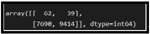 
 
3. Classification Report: 
   
 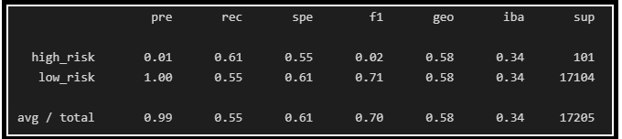 
 

***The accuracy score of 58.21 for this model is low. The F1 score and Precision for high-risk prediction is only .02 and .01 only. The higher the F1 score (close to 1) the better it is. Hence this model is not a very good model for predicting high credit risk.***

###  SMOTEENN Combination Sampling algorithm and Logistic Regression

**SMOTEENN** combines the SMOTE and Edited Nearest Neighbors (ENN) algorithms. SMOTEENN is a two-step process:

* Oversample the minority class with SMOTE.
* Clean the resulting data with an undersampling strategy. If the two nearest neighbors of a data point belong to two different classes, that data point is dropped.

1. Accuracy: 67.38%
2. Confusion Matrix: 
   
 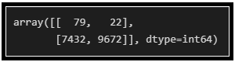 
 
3. Classification Report: 
   
 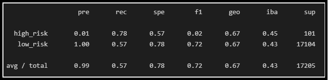 
 

***The accuracy score of 67.38 for this model is low. The F1 score and Precision for high-risk prediction is only .02 and .01 only. The higher the F1 score (close to 1) the better it is. Hence this model is not a very good model for predicting high credit risk.***

###  Balanced Random Forest algorithm 

A **balanced random forest** randomly under-samples each boostrap sample to balance it.

1. Accuracy: 78.85%

2. Confusion Matrix: 
   
 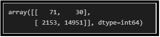 
 
3. Classification Report: 
   
 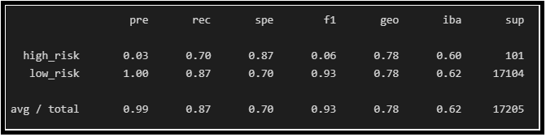 
 

***The accuracy score increases to 78.85 for this model. The F1 score and Precision for high-risk prediction is .06 and .03 respectively. The F1 score for this model is much better as compared to the other 4 models discussed above.Hence this seems to be a better model.***

###  Easy Ensemble ADA Boost Classifier 

An **AdaBoost** classifier is a meta-estimator that begins by fitting a classifier on the original dataset and then fits additional copies of the classifier on the same dataset but where the weights of incorrectly classified instances are adjusted such that subsequent classifiers focus more on difficult cases.

1. Accuracy: 93.16%

2. Confusion Matrix: 
   
 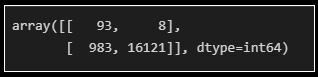 
 
3. Classification Report: 
   
 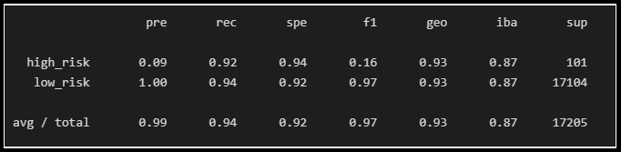 
 

***This models has a very good accuracy score of 93.16. The F1 score and Precision for high-risk prediction is .16 and .09 respectively. It's F-score for high-risk prediction is still low compared to other models.***

##  Summary

In summary, predicting credit-risk is a highly sensitive and important task and we have to make sure that the model we choose should be able to predict maximum of the high  credit-risks. We have to also make sure that the model should not be overfitting the data. 
Out of the 6 models analyzed above, ADABoost has the highest accuracy score. Even though this model looks much better compared to the other models, we would have to use this model with caution as it might be prone to overfitting. Hence we would have to hypertune and train our models for bigger datasets.

I would further like to train the data with some other models and check their accuracy score to decide on the model for this task.

##  Resources
[1] [Credit Loan data](LoanStats_2019Q1.csv)  

[2] Software: 
* Python 3.10.2
* Visual Studio Code 1.64.2
* Jupyter Notebook

[3] Libraries:
* Scikit-learn

##  References

https://imbalanced-learn.org/stable/over_sampling.html  
https://machinelearningmastery.com/smote-oversampling-for-imbalanced-classification/  
https://imbalanced-learn.org/stable/references/generated/imblearn.under_sampling.ClusterCentroids.html  
https://imbalanced-learn.org/stable/references/generated/imblearn.combine.SMOTEENN.html  
https://imbalanced-learn.org/stable/references/generated/imblearn.ensemble.BalancedRandomForestClassifier.html  
https://imbalanced-learn.org/stable/references/generated/imblearn.ensemble.EasyEnsembleClassifier.html  

